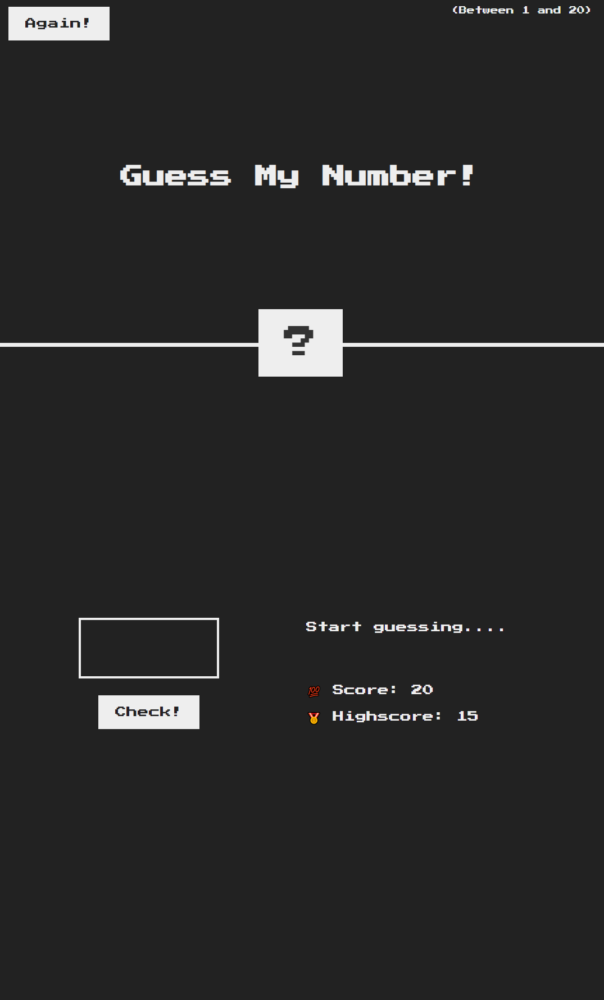

[][license-url]
[![LinkedIn][linkedin-shield]][linkedin-url]

# Guessing-game
Live site: https://dextervorbe.github.io/Guessing-game/

An application where the user will be able to input a guess to try to determine the correct number. User will be promted if a guess is too high or too low and if the user guesses the correct value the game will save the highscore and the player will be able to play again.

### Built With

* 

* 

* 

<!-- GETTING STARTED -->
# Project Hurtles
My one biggest hurtle during this project figuring out how to have the player reset the game. The way I went about solving this issue is by having the player click on the again button and then set all the conditions back to it's original state.

[license-url]:LICENSE

[Next.js]: https://img.shields.io/badge/next.js-000000?style=for-the-badge&logo=nextdotjs&logoColor=white

[linkedin-shield]: https://img.shields.io/badge/-LinkedIn-black.svg?

[linkedin-url]: https://www.linkedin.com/in/dextervorbe/